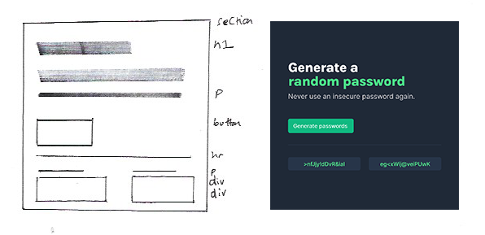

## PLAN

Create a random password generator using html, css & javascript

### MVP

- When a button is clicked two random passwords will be generated
- responsive layout
- styled with css

### STEPS

- basic file/folder setup ✅
  - index.html, css: style.css + mediaqueries.css, js: index.js, \_assets folder ✅
- sketch layout ✅
- 
  - think about component tree and identify components required ✅
- code component structure ✅
- look for patterns ✅
- psuedo code the algo ✅
- code the functionality ✅
  - Generate password btn: onclick/addEventListener"click", function ()=>{} ✅
  - create array of potential characters ✅
  - generate random character ✅
    - Math.floor(Math.random()\*character.length) ✅
    - Loop over characters array and generate a random set of characters of average length(8/9 characters) v
      - for loop for 8 loops ✅
      - Math for random number 8 times ✅
      - use random number as index of character for random character ✅
      - push to new array to store as password 1 (do same for password 2) ✅
      - turn array toString() for string password ✅
      - get password elements by id from html ✅
      - set textContent to value of strings respectively ✅
      - remove commas from string with .replace(/,/g, "") ✅
      - repeat for second password ✅

### STRETCH GOALS

- Click to copy password feature
  - add icon to each password area (try materialicons and lower opacity)
    - on click get the value of the div
    - on click have a prompt below password area to say copy was successful
    - use a set timeout on the visibility?
- Choose password made of letters of symbols
- Select length of random password
